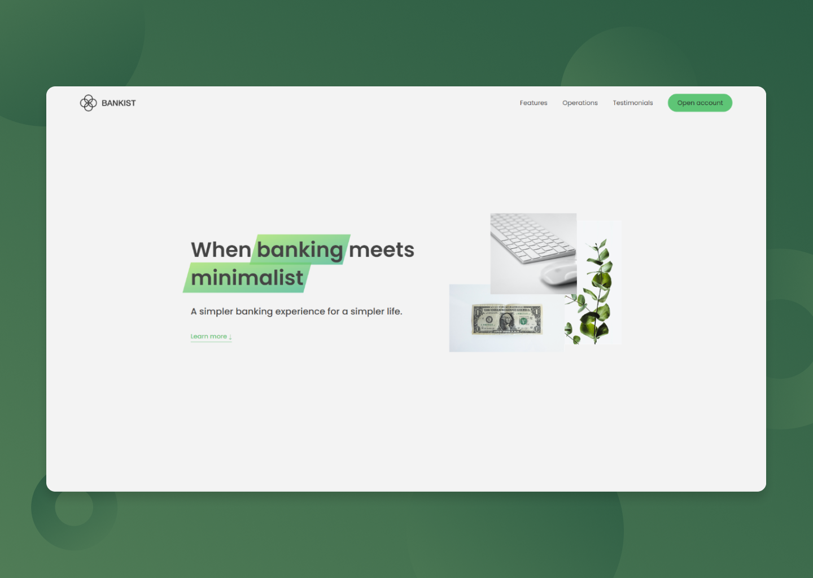

  

    <h1>Bankist</h1>
     
    
A Modern Website for a Banking Company with a Minimalist Experience

    <h3><a href="https://bankist-cem.netlify.app/">🔗 Link to the Website</a></h2>
    
  

## Built With

## Features

- Advanced UI Component built with CSS & JavaScript
- Minimalist & Professional Design
- Lazy Loading

## Context of the project

This is a part of a Front-End Dev course that i've completed on Udemy
